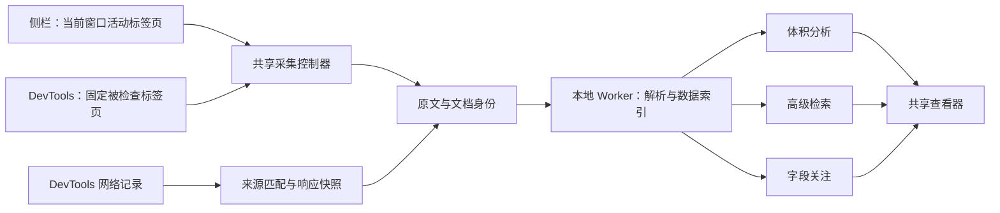

# Payload 分析、检索关注与 DevTools 请求关联方案

日期：2026-09-28。状态：首版功能已实现，完整 E2E 待本轮授权。以下保留设计与验收约定；具体交付、预算、性能和未验证边界见 [实现记录](analysis-search-devtools-implementation.md)。

## 1. 目标与产品边界

在现有 Nuxt 3／4 初始 payload 查看器上增加三个工作流：发现大字段、持续查看关键字段、解释数据与浏览器请求的关系。沿用当前 monorepo、Node 22、Vue 与 WXT 工具链。

| 方向                    | 用户要解决的问题                         | 首版交付                                                             |
| ----------------------- | ---------------------------------------- | -------------------------------------------------------------------- |
| Payload 体积分析        | 哪份原文大、哪些字段值得检查             | 来源原文字节、字段估算排名、长字符串／大集合、共享引用提示、分析报告 |
| 高级检索与字段关注      | 如何快速定位数据，刷新后关键值是否变化   | 结构化筛选、路径匹配、类型／值条件、收藏查询、关注字段与快照变化提示 |
| DevTools 面板与请求关联 | 哪个资源承载 payload，浏览器实际收到什么 | 独立开发者工具面板、请求列表、来源关联、响应体比较、关联依据         |

首版继续面向初始 JSON payload。字段关注随成功采集的新快照更新，不承诺监听页面运行时 ref／store；请求记录以浏览器可观察到的请求为范围。Nuxt 2、服务端调用追踪与完整运行时调试不在本轮范围内。

推荐交付顺序：公共数据模型 → 体积分析 → 高级检索与字段关注 → DevTools 完整面板和请求关联。DevTools 的最小可行性验证提前到公共模型阶段，及早确认真实面板和网络 API 可测试。

## 2. 当前实现中必须先处理的问题

| 当前实现                                                                                                    | 对新增功能的影响                          | 调整                                                 |
| ----------------------------------------------------------------------------------------------------------- | ----------------------------------------- | ---------------------------------------------------- |
| `RawSource.bytes` 在成功读取时主要统计 `JSON.stringify(text)` 的 UTF-8 字节；超限分支还可能是提前停止的计数 | 不能直接作为 payload 原文体积或网络传输量 | 明确拆分原文度量、消息预算与未完整测量状态           |
| 搜索遍历当前分类的 `DataTree`，上限 10,000 节点／60 层／100 条结果                                          | 不能声称检索了所有已采集数据              | 建立独立查询索引与覆盖范围说明                       |
| `parseApp` 将内嵌与外部来源浅合并                                                                           | 合并后字段失去来源归属                    | 保留来源快照，记录顶层字段来自哪份原文；后代继承来源 |
| `useInspection` 查询所在窗口的活动标签页                                                                    | DevTools 应绑定被检查标签页               | 抽出目标适配器，复用采集控制器                       |
| `App.vue` 同时承载采集、解析、筛选、下载和界面                                                              | 两个入口容易出现重复实现                  | 抽出共享查看器与独立的界面外壳                       |

保持现有请求取消与 `tabId + documentId + requestId` 核验；所有分析、检索、关注和响应体异步任务另带快照身份，旧任务不能写入新页面。

## 3. 公共模型与结构

统一使用以下身份：

- `snapshotId`：一次采集或一次明确选中的网络响应快照。
- `sourceId`：该快照内的一份原文；记录 `kind`（内嵌／外部）和 `transport`（DOM／扩展重新获取／DevTools 响应）。
- `nodeId`：当前快照中稳定的节点编号，用于索引、树形定位和引用关系；不作为跨刷新身份。
- `FieldPath`：结构化路径段，区分对象属性、数组索引、Map 的键／值与 Set 成员。显示路径是它的可读格式，禁止用字符串表达式执行取值。
- `coverage`：完整／部分／失败，包含已扫描节点数、预算和中止原因。体积估算、检索、比较分别记录覆盖状态。

每个来源保留原文、时间、内容摘要和文档信息；网络观察内容与扩展重新获取内容分别记录，不能自动覆盖为同一份来源。业务层浅合并行为保持一致，并在字段详情展示来源以及被覆盖的同名顶层字段。

分析 Worker 直接接收原文并解码，保留类型和引用语义；返回有界、可序列化的节点摘要，不往扩展消息中传递循环对象或 `PayloadTag` 类实例。视图与 Worker 协议逐步迁移，每一步保持已有测试可运行。

首版每个界面只保留当前应用的分析索引，切换应用时释放旧索引，避免 16 个应用各自耗尽一份预算。网络正文、关注值和索引分别限制，并记录总缓存用量。

现有单应用维护范围足够，不立即创建新的公共 npm 包；模块先放在 `apps/extension/features/`。需要与其他应用真实共享代码时再提取 `packages/`。

## 4. Payload 体积分析

### 4.1 展示与交互

新增一级「分析」视图，下设：

- 总览：已采集来源数、每份原文的 UTF-8 字节、完整性和解析状态。
- 字段排名：按独立字段的结构估算排序，展示路径、类型、项数、估算值与共享引用情况。
- 内容分布：长字符串、大数组／Map／Set、深层结构；点击后打开相应字段。
- 来源比较：同名字段被外部来源覆盖时，查看两份来源，避免误以为未显示字段没有传输成本。
- 导出：带版本号的分析 JSON，记录算法、范围、来源与预算。首版不增加复杂图表依赖，以条形图与可排序表格为主。

例如：原文为 840 KiB，某商品列表的结构估算为 520 KiB、包含 2,000 项；点击后进入该列表并可继续检索或关注。示例数值只说明交互，不代表测量结果。

### 4.2 统计口径

| 指标             | 计算或来源                            | 产品表述                         |
| ---------------- | ------------------------------------- | -------------------------------- |
| `rawUtf8Bytes`   | 对已完整采集的原文执行 UTF-8 编码计数 | 已采集原文 UTF-8 字节            |
| `messageBytes`   | 原文作为 JSON 字符串传递时的编码计数  | 扩展采集预算，主要供诊断使用     |
| `estimatedBytes` | 有版本号的结构估算器                  | 字段估算体积                     |
| 网络响应大小     | DevTools HAR 的明确字段               | 标注字段含义、请求来源及是否可用 |

内嵌原文计数不含 HTML 标签，不包含整个文档体积；外部文本按解码后文本计算，不能冒充压缩传输字节。原文读取失败或提前终止时，精确值为未知，已读字节／下界独立保存；失败来源不把预算占用混入总原文体积。

首版估算器按键名、标量字面量、容器和显式引用标记计算，特殊类型规则写入算法说明。每个字段单独计算可达结构，遇到循环终止，同一对象在该字段内只展开一次。不同字段可能共享对象，因此字段估算不能相加后冒充总原文体积，也不显示「删除该字段可减少多少下载字节」。

共享引用是序列化格式已经节省空间的证据之一，不直接等同于应删除的重复数据。深度、节点、时间预算耗尽时，排名标明仅覆盖已分析部分。

### 4.3 后续精确归因

第二阶段可为已支持的 devalue 格式建立原文 token 区间与引用表索引，将字节分为独占条目、共享条目及语法开销。只有这些互斥分组可以相加校验为来源原文总量；字段的可达条目集合仍可能重叠。

这部分需要单独验证特殊类型与未知 reducer，不能将所有数字都当成引用索引。超出已验证格式时退回估算或仅展示原文总量。压缩后字段贡献具有跨字段依赖，仍不承诺逐字段精确分摊。

### 4.4 验收

中文、emoji、反斜杠、换行与转义字符的原文字节与消息预算明确不同；循环、共享引用、外部覆盖和失败来源不会重复或错误累计。所有估算结果都有算法版本和覆盖状态，点击排名能定位到对应字段。

## 5. 高级检索与字段关注

### 5.1 高级检索

保留简单搜索，增加可视化条件编辑器；条件最终编译为自有查询 AST，首版不依赖完整 JSONPath，也不执行用户输入的 JavaScript。

| 条件 | 首版支持                                                       |
| ---- | -------------------------------------------------------------- |
| 范围 | 当前分类／当前应用的已采集数据；可选原始来源视图               |
| 字段 | 键名、结构化路径、值、基础类型、Nuxt 包装标签                  |
| 比较 | 包含、等于、不等于、数字大小、路径存在／缺失                   |
| 组合 | 一层「全部满足」或「任一满足」；保留界面可解释性               |
| 路径 | 精确路径、单层通配 `*`、数组通配 `[*]`                         |
| 结果 | 路径、预览、类型、来源、命中理由；分页、复制、导出、跳转与关注 |

典型查询由界面生成：在 `data` 中筛选路径 `products[*].price`，类型为数字且值大于 100；筛选 `state` 下值为 `false` 的字段；查询指定路径是否存在。

字符串不隐式转换为数字；区分缺失、undefined、null、空字符串和数组空洞。通配路径的「缺失」按已解析到的父节点集合计算；扫描不完整时返回「无法确认」，不能当作不存在。正则作为后续增强，必须在可终止的独立 Worker 中执行，并限制表达式、输入长度与单次时间预算。

索引与树形展开分离：即使字段位于当前树的 10,000 节点预算之外，也能在索引覆盖范围内被查询；点击命中可显示该路径的局部子树。共享对象只索引一份实体，同时保留引用边；别名路径按查询预算解析，不能无限展开循环。

查询结果明确区分「0 条匹配且扫描完整」「当前已扫描范围没有匹配」「结果达到展示上限」。收藏查询仅保存条件和站点作用域，不保存匹配值。

### 5.2 字段关注

节点增加「关注」操作，关注列表显示别名、路径、类型、当前快照值、上次快照值与状态。首版状态包括首次出现、未变化、值变化、类型变化、缺失、无法确认和页面范围不匹配。

- 默认作用域为 origin + 初始文档 pathname + 应用选择条件；是否纳入查询参数由用户配置，hash 默认不参与。
- 当前 `app.id` 包含节点序号，不能直接作为长期唯一标识。优先使用应用声明标识；没有标识或重名时提示重新选择，不自动绑定另一个应用。
- 定义存入 `chrome.storage.local`；最近值和比较基线只留在当前界面会话内。重新打开面板时重新建立基线。
- 同一标签页、作用域和来源模式内比较相邻两次成功快照。错误、取消、解析不完整、超预算不会被解释成字段删除。
- SPA 导航后仍只有初始 payload 时，保留初始文档提示，不将客户端状态变化虚构为关注字段更新。
- 数组首版按位置关注，明确提示重新排序会影响目标；按业务 ID 追踪作为后续能力。Map／Set 的位置路径也不承诺实体稳定。

标量采用保留类型的比较，区分 `-0`、NaN、BigInt 等；对象采用有界、类型感知的图比较，保留循环与共享引用关系。摘要仅加速筛选，不能用截断预览或摘要碰撞判定完全相等。预算不足时提示比较未完成。

两个界面共享关注规则，但各自维护值与基线，避免侧栏和 DevTools 在不同刷新时刻相互覆盖。

### 5.3 验收

覆盖带点号／引号的属性名、键名与数组索引的区别、特殊类型、通配路径、索引截断、查询取消、共享引用与循环；关注项在刷新、字段消失、类型变化、路由切换和多应用顺序变化时状态准确。仅在成功取得新快照后更新比较基线。

## 6. DevTools 面板与请求关联

### 6.1 面板与采集目标

新增开发者工具中的「Page Inspector」标签页，共用数据、原文、分析、检索与关注组件，宽屏下采用字段树和详情并排布局；侧栏保持适合窄屏的布局。

WXT 使用 `entrypoints/devtools/index.html` 注册入口，再创建独立面板页面；浏览器 manifest 增加 `devtools_page`。浏览器提供的被检查标签页 ID 作为固定采集目标，用户切换普通标签页不能改变该 DevTools 会话的目标。[WXT 入口约定](https://wxt.dev/guide/essentials/entrypoints#devtools)、[Chrome 面板 API](https://developer.chrome.com/docs/extensions/reference/api/devtools/panels)、[被检查窗口 API](https://developer.chrome.com/docs/extensions/reference/api/devtools/inspectedWindow)

继续经后台 `scripting.executeScript` 读取 DOM，首版不依赖 `inspectedWindow.eval` 获取运行时对象。沿用现有 storage、scripting、sidePanel 和 HTTP／HTTPS 权限，网络观察使用 DevTools API，不新增 debugger 或 webRequest 权限。

### 6.2 请求列表与内容读取

DevTools 会话建立后订阅 `onRequestFinished`，取得 `getHAR()` 中可用的历史记录，并监听导航事件。保留请求 URL、方法、状态、开始时间、耗时、资源类型／MIME 和可用的大小字段。响应体通过请求对象的 `getContent()` 按需读取。[Chrome 网络 API](https://developer.chrome.com/docs/extensions/reference/api/devtools/network)

DevTools 关闭时没有这条观察通道；晚打开时历史记录可能不完整，界面应展示开始观察时间，并提供用户主动刷新页面的入口。首版侧栏独立工作，完整请求列表放在 DevTools 中；侧栏接收正在运行的 DevTools 会话摘要可后续增加。

浏览器支持目标仍为 Chrome 116+，不直接依赖新文档中的 Promise 签名；相关 API 的 Promise 形式标注为 Chrome 151+，实施时使用可覆盖目标版本的回调适配层，并实际验证兼容性。[API 版本标注](https://developer.chrome.com/docs/extensions/reference/api/devtools/network)

网络内容遵循以下规则：

- 默认记录元信息，优先允许读取已声明的 payload URL。任意业务请求响应体由用户选择查看后再读取。
- `getContent` 取得的是浏览器可提供的响应内容，可能不可用或使用 base64 编码；它不是可自行限流的下载接口。先根据元信息拒绝已知超大内容，未知大小默认只展示元信息；读取后再核验预算，不能承诺 API 返回前已严格限制分配量。
- 文本 UTF-8 大小、HAR `content.size` 与 `bodySize` 分别展示；缺失或 `-1` 为未知。缓存、304 和压缩结果按实际字段说明，不能一律把 0 当作无内容。[HAR 字段定义](https://github.com/ahmadnassri/har-spec/blob/master/versions/1.2.md)
- 扩展自己的重新获取不是被检查页面的业务请求，两份内容分别标注；不会为了生成关联主动重放业务请求。
- 首版提供本面板请求详情、复制 URL 和查看响应，原生 Network 精确行跳转须先验证公开 API 能力，再决定是否纳入。

### 6.3 关联规则与可信度

| 关联结果   | 依据                                                 | 能得出的结论                         |
| ---------- | ---------------------------------------------------- | ------------------------------------ |
| 内容已核对 | 声明的外部 URL、可信文档／导航归属及响应正文核对一致 | 观察到的请求与这份已采集来源内容一致 |
| 来源候选   | URL 对应声明地址，但正文或文档归属未核实             | 是候选资源，不能保证为同一版本       |
| 业务候选   | 用户手动选择，或已读取 JSON 中有相同业务 ID／结构    | 可辅助排查，不代表字段来自该请求     |
| 无法关联   | 服务端请求不可见、历史缺失、内容不可读或信息不足     | 明确列出原因                         |

请求与来源按完整 URL 匹配，保留查询参数，不擅自排序或删除参数。重定向根据可观察到的响应链记录，证据不够时降为候选。相同 URL 的重复请求保留为多条，不按 URL 去重；历史 HAR 与实时事件的重复导入采用会话内去重，无法分辨的记录宁可标记歧义。

Nuxt 的 payload 数据键可能由请求和选项生成哈希，也可能由业务显式指定；`pick`、`transform` 或 useAsyncData 的任意处理会改变数据形态。因此不能从 payload key 自动反推出 API 地址，也不能把相似响应直接标成确定来源。这一判断以当前两个验证版本的源码为依据。[Nuxt 3 useFetch](https://github.com/nuxt/nuxt/blob/v3.21.11/packages/nuxt/src/app/composables/fetch.ts)、[Nuxt 4 useFetch](https://github.com/nuxt/nuxt/blob/v4.5.2/packages/nuxt/src/app/composables/fetch.ts)

服务端 SSR 的 API 调用发生在服务器，浏览器 Network 不提供完整服务端调用链。若将来要求「字段 → useAsyncData/useFetch → 服务端接口」的确定关联，需要另做可选 Nuxt 模块或开发插件，显式输出请求与 payload key 的映射；这是有应用配合的扩展方向。

### 6.4 生命周期和资源所有权

每个 DevTools 窗口有自己的 `sessionId` 和固定 `tabId`。请求对象及 `getContent` 能力保留在 DevTools 会话中，只传递可序列化摘要，不将函数放进扩展消息。

完整导航产生新一代页面记录，SPA 地址变化保留当前文档身份。HAR 不保证携带 Chrome 的 `documentId`：关联综合已确认的文档、HAR 页面归属和时间信息；无法证明属于当前文档的晚到响应不直接归入新页面。后台重启后重新握手，DevTools 会话不依赖后台内存保存整个请求列表。

默认导航后清理旧列表；启用「保留记录」时仍按页面分组并受总预算约束。关闭 DevTools 后释放网络监听、响应缓存和 Worker；普通侧栏采集继续可用。

### 6.5 验收

必须在真实 DevTools 面板中验证：面板注册、固定 tabId、请求完成事件、正文读取、导航隔离、关闭清理与侧栏共存。用普通扩展页面模拟 DevTools API，只能算单元或组件测试，不能算浏览器验收通过。

## 7. 预算与响应性

以下是首版建议默认值，实施时结合现有 100 KiB／1 MiB／10 MiB 样本校准，不作为已达到的性能承诺：

| 资源           | 初始预算                                              |
| -------------- | ----------------------------------------------------- |
| 采集原文       | 沿用当前 12 MiB 消息预算与 16 个应用上限              |
| 树形展示       | 保持单分类 10,000 节点／60 层、每次展开 100 项        |
| 单应用分析索引 | 100,000 节点、最大 100 层；独立于展示预算             |
| 检索结果       | 每页 50 条，最多保留 1,000 条，达到上限提示           |
| 分析／查询任务 | 每项初始时间预算 2 秒；可取消，超时返回部分结果或未知 |
| 关注定义       | 每个作用域最多 50 项；历史默认只保留上一份比较基线    |
| 关注值缓存     | 当前会话合计 2 MiB，超出只保留摘要并标记不能完整比较  |
| 网络记录       | 每个 DevTools 会话最多 500 条元信息、2 MiB 字符串内容 |
| 响应正文缓存   | 合计 12 MiB，按最近使用淘汰，与网络元信息分开         |

Worker 内按批次处理，界面主线程保留取消操作；旧查询、切换应用和换页会取消旧任务。顶层解析或正则若无法协作中断，由宿主终止 Worker，并说明需重建索引。局部子树读取也必须计入预算。

定义与收藏条件本地持久化；payload 值、响应正文和请求身份信息默认不写磁盘。网络记录只保留功能需要的字段，首版不存 Cookie、Authorization 或请求体；分析报告默认不包含完整业务值，原文仍走用户显式导出入口。

## 8. 建议代码划分

以下路径均相对于 `apps/extension/`，为实施时的建议新增／调整位置：

| 路径                                   | 职责                                       |
| -------------------------------------- | ------------------------------------------ |
| `features/inspection/`                 | 快照／来源身份、目标适配器、统一采集控制器 |
| `features/analysis/`                   | 原文字节、结构估算、字段排名和报告         |
| `features/query/`                      | 路径 AST、筛选条件、索引、覆盖状态与分页   |
| `features/watch/`                      | 关注定义、站点作用域、路径解析与图比较     |
| `features/network/`                    | HAR 适配、请求会话、来源匹配和内容缓存     |
| `features/inspector/InspectorView.vue` | 两种入口复用的查看器                       |
| `workers/payload.worker.ts`            | 原文解码、有界遍历、索引与任务取消         |
| `entrypoints/sidepanel/`               | 侧栏外壳与活动标签页目标                   |
| `entrypoints/devtools/`                | DevTools 注册与会话入口                    |
| `entrypoints/inspector-panel/`         | 独立 DevTools 面板页面                     |
| `tests/real-nuxt/`                     | 六组真实应用基础上的功能验收               |

保持已有 `page-inspector/v1` 视图导出兼容；分析报告、查询收藏和关注规则采用各自带版本号的格式。存储升级要处理旧版／损坏规则，不能因此使扩展无法打开。

## 9. 测试设计

现有 48 项单元测试、5 项协议 E2E 和 18 项真实 Nuxt E2E 是回归基线，新增场景围绕实际功能编写，不以自家估算器生成预期值来证明估算器正确。

| 层级      | 新增重点                                                                                    |
| --------- | ------------------------------------------------------------------------------------------- |
| 纯函数    | UTF-8 原文计数、消息预算、估算规则、引用图、路径转义、条件组合、类型比较、未知状态          |
| 生命周期  | 取消、旧查询晚到、关注规则加载竞争、多应用换序、侧栏活动页与 DevTools 固定页共存            |
| 真实 Nuxt | 含中文与 emoji 的大字段、共享数据、外部覆盖、字段增加／删除／变类型、数组重排               |
| 真实网络  | 相同 URL 多次不同响应、带查询参数、重定向、304／缓存、压缩、正文不可读、DevTools 晚开       |
| 阴性用例  | SSR API 请求在浏览器不可见；SPA 状态变更不伪装成初始 payload 变化；相似 JSON 不自动确定来源 |
| 性能      | 分析与查询期间仍可取消／切换分类；达到预算后保留明确的部分结果；记录环境、耗时和峰值趋势    |

Nuxt 测试页增加可控的客户端请求按钮，确保网络事件确实发生；服务端数据与客户端请求分别建立断言。请求关联测试使用独立人工映射与已知原文作为预期，不调用生产关联函数生成期望结果。

DevTools 自动化先完成真实目标接入探针；若当前自动化工具无法稳定控制该目标，保留人工 Chrome／Edge 验收步骤并明确标记自动化缺口，不能用 mock 结果替代。Chrome 116+ 为目标范围，新增 API 的最低版本兼容需单列验证，当前 Chromium 通过不代表所有历史版本已测。

实施期间安装新依赖前重新联网查询版本。新增 DevTools E2E 属于新的执行范围，执行前按项目约定取得确认；本方案本身不视为 E2E 授权。本次浏览器执行状态以实现记录为准。

## 10. 分阶段交付与完成定义

| 阶段                  | 交付内容                                                              | 验收门槛                                                       |
| --------------------- | --------------------------------------------------------------------- | -------------------------------------------------------------- |
| A：公共基础与风险验证 | 修正字节口径、来源归属、目标适配器、结构化路径；DevTools 最小接入探针 | 原有行为不回退，证明真实 DevTools 网络读取可行，明确自动化路径 |
| B：体积分析首版       | 来源总览、字段结构估算排名、详情定位、分析报告、有界 Worker           | 字节口径准确，循环与共享引用无失控遍历，估算与截断明确可见     |
| C：检索与关注         | 可视化条件、独立索引、局部子树、收藏、关注定义与快照比较              | 未展开字段可搜索，缺失／未知区分，刷新比较与作用域隔离可靠     |
| D：DevTools 与关联    | 共用面板、网络列表、按需正文、来源／候选关联及生命周期                | 固定标签页归属可靠，不将 SSR API 或猜测关系报告为已确认来源    |
| E：整体验收与文档     | 六组 Nuxt 回归、新增专项验收、性能记录、兼容说明                      | 记录真实测试环境与失败边界，全部承诺范围有对应验证             |

首轮整体包含 B／C／D 的实用能力；精确 devalue 字节归因、复杂正则／递归查询、按业务 ID 关注、运行时状态追踪、服务端追踪模块和原生 Network 精确跳转作为后续增强。

每个阶段分别提交，交付代码、适配说明、测试结果及更新后的中文文档。界面优先让用户完成「找到大字段 → 筛选目标 → 关注变化 → 查看来源请求」这条完整流程。
