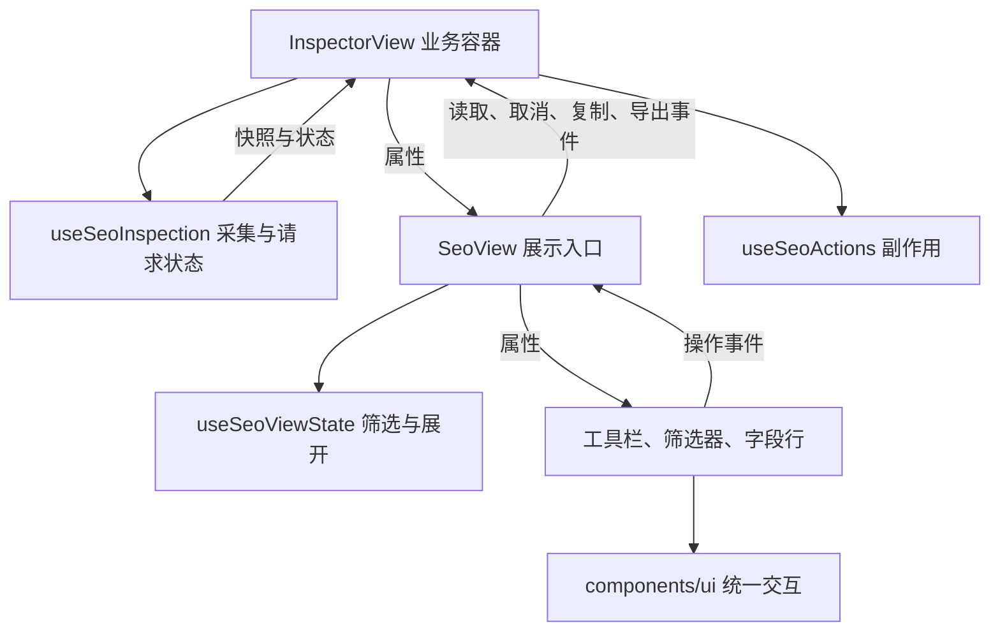

# 组件与数据流约定

本文以正在运行的数据、分析、检索、关注、SEO 和网络工作区作为模板。新增功能优先复用基础组件，再按职责拆分业务容器、视图状态和展示组件。

## 状态归属

| 类别     | 示例                                                   | 所有者                       | 更新方式                          |
| -------- | ------------------------------------------------------ | ---------------------------- | --------------------------------- |
| 业务数据 | DOM／HTML 快照、网络记录、Worker 结果                  | 业务组合函数或会话           | 采集、解析、业务操作产生新结果    |
| 业务状态 | 读取中、失败、取消、请求代次、当前文档身份             | 发起操作的业务层             | 业务动作更新，组件从属性读取      |
| 组件数据 | 页签项、选项标签、行摘要、过滤后的展示列表             | 视图配置或 `computed`        | 从输入数据派生，不改写原始快照    |
| 组件状态 | 当前页签、搜索文本、展开行、展示条数、Tooltip 是否打开 | 最近的共同组件或视图组合函数 | `v-model`、明确事件或组件内部状态 |

组件状态不等于全部放进组件内部。两个兄弟组件共同需要的状态由它们的共同父级持有，例如页头和工作区共享采集状态。Tooltip 的打开状态则留在基础组件内部。

“保留导航前请求”会改变网络会话的行为，属于业务设置；复选框从会话读取，通过事件申请修改，不能再维护一份可能失步的本地值。

## 数据流



- 数据向下传，操作意图向上报；父级决定是否接受更新。
- 展示组件不采集、不访问存储、不启动 Worker、不直接执行复制或下载。字段复制入口通过 `useFieldActions` 绑定动作，所有剪贴板和下载调用集中在 `useArtifactActions`。
- 不通过组件实例读取业务数据或调用业务命令。组件引用只用于聚焦、滚动等 DOM 操作。
- 不把输入快照复制到 `ref` 再用双向监听同步。筛选结果、选中详情和摘要用 `computed` 从当前输入派生。
- 对象形式的受控表单发出新对象，如 `emit('update:modelValue', { ...props.modelValue, search })`；禁止修改属性对象的嵌套字段。
- 异步结果必须校验文档身份、请求代次和卸载状态。此规则继续由 `useSeoInspection` 等业务层负责，基础组件不能替代它。

## 可直接参考的文件

| 职责                     | 文件                                                     |
| ------------------------ | -------------------------------------------------------- |
| 业务容器与跨工作区协调   | `apps/extension/features/inspector/InspectorView.vue`    |
| 采集、取消和过期结果隔离 | `apps/extension/composables/useSeoInspection.ts`         |
| 复制与报告导出           | `apps/extension/features/seo/useSeoActions.ts`           |
| 视图入口、属性与事件契约 | `apps/extension/features/seo/SeoView.vue`                |
| 组件状态、筛选及派生列表 | `apps/extension/features/seo/useSeoViewState.ts`         |
| 受控对象表单             | `apps/extension/features/seo/components/SeoFilters.vue`  |
| 受控展开行               | `apps/extension/features/seo/components/SeoFieldRow.vue` |
| 异步动作入口             | `apps/extension/features/seo/components/SeoToolbar.vue`  |
| 跨视图共享网络会话       | `apps/extension/features/network/useNetworkSession.ts`   |

## 各工作区的职责划分

| 工作区 | 业务数据与动作                                                            | 组件状态与展示                                                                            |
| ------ | ------------------------------------------------------------------------- | ----------------------------------------------------------------------------------------- |
| 数据   | `useSnapshotSelection` 决定页面快照或网络响应；`useFieldActions` 处理复制 | `usePayloadViewState` 派生当前树、搜索与选中节点；`DataView` 受控展示                     |
| 分析   | `useWorkbenchIndex` 建立共享索引；`useAnalysisSession` 接收分析结果       | `AnalysisView` 派生排名；排序偏好留在 `useWorkbenchViewState`                             |
| 检索   | `useQuerySession` 保存已提交条件、结果、错误和分页                        | `QueryConditionEditor` 发出完整新模型；草稿留在 `useWorkbenchViewState`                   |
| 关注   | `useWatchRules` 管理存储、适用范围、待完成操作和会话基线                  | `WatchView` 展示规则并发出添加、重命名、删除意图                                          |
| SEO    | `useSeoInspection` 采集；`useSeoActions` 生成报告                         | `useSeoViewState` 管理筛选与展开；子组件保持受控                                          |
| 网络   | `useNetworkSession` 持有唯一会话与浏览器动作                              | `useNetworkViewState` 根据修订号派生列表、关联信息和选择；`NetworkRequestDetail` 展示正文 |

`InspectorView` 只协调采集、当前工作区与业务入口，页头、页脚和数据浏览器分别装配。`FeatureWorkbench` 协调共享索引及分析、查询、关注，不包含各个页面的表单和结果列表。`InlineFieldDetail` 通过插槽接入分析与查询，保持相同的就地展开和事件语义。

### 异步结果与草稿模板

1. 视图通过事件提交操作，业务层在提交时复制必要参数。
2. 执行中的条件与可继续编辑的草稿分开；查询分页和导出使用 `executedSpec`，不读当前表单。
3. 重建或取消索引先递增 `generation`，再停止旧 Worker；各业务结果同步清理。
4. 详情和查询另有请求序号，同一快照内连续操作也只接受最新响应。关闭详情会废弃在途响应。
5. 关注写入捕获提交时的范围，以“范围＋路径”去重。切换页面后旧操作不会点亮新范围的忙碌状态；比较基线仅存在面板会话中。
6. 表单成功后的清理先核对草稿仍未改变，避免清空等待期间的新输入。

直接复用 `QueryConditionEditor.vue` 的不可变嵌套更新写法，以及 `useQuerySession.ts` 的草稿／执行结果隔离写法。不要增加通用全局状态仓库来保存临时展开、搜索或 Tooltip 状态。

文件按职责拆分，不按行数机械拆分。仅属于某项业务的组件放在该业务的 `components/`；不依赖业务模型、确实可以复用的交互组件才放进 `components/ui/`。

## 基础组件模板

Ark UI 固定为 `@ark-ui/vue@5.39.2`，通过组件子路径导入。业务模块使用项目包装组件，默认键盘操作和行为配置集中在包装层。ESLint 限制业务模块直接导入 Ark UI，也限制基础组件依赖业务模块。

```vue
<script setup lang="ts">
import { ref } from 'vue'
import UiTabList from '@/components/ui/UiTabList.vue'
import UiTabPanel from '@/components/ui/UiTabPanel.vue'
import UiTabs from '@/components/ui/UiTabs.vue'

const items = [
  { id: 'summary', label: '概览' },
  { id: 'details', label: '详情' },
] as const
const selected = ref<typeof items[number]['id']>('summary')
</script>

<template>
  <UiTabs v-model="selected" :items="items">
    <section>
      <UiTabList label="查看方式" />
      <UiTabPanel :value="selected">
        <div>
          <slot :view="selected" />
        </div>
      </UiTabPanel>
    </section>
  </UiTabs>
</template>
```

`UiTabs` 和 `UiTabPanel` 使用 `asChild`，插槽应提供一个元素根节点。需要 DOM 引用时将 `ref` 放在包装组件上，通过其 `$el` 访问根元素；Ark UI 会克隆插槽节点，直接放在插槽根元素上的 `ref` 不能作为可靠接口。

当前工作区共享一个面板，通过 `value` 关联当前页签，不因切换增加 `key` 强制重建整棵视图。需要独立面板时可以创建多个 `UiTabPanel`，但要明确内容保留和卸载策略。

| 组件                                  | 统一行为                                                          | 状态归属                                       |
| ------------------------------------- | ----------------------------------------------------------------- | ---------------------------------------------- |
| `UiTabs` / `UiTabList` / `UiTabPanel` | 方向键移动焦点，Enter／Space 激活；跳过禁用项；统一页签与面板关联 | 选中值由父级持有，焦点由 Ark UI 管理           |
| `UiTooltip`                           | 悬停延迟 400ms、离开延迟 100ms，聚焦可读，Escape 关闭             | Ark UI 内部状态                                |
| `UiActionButton`                      | 真实按钮、统一尺寸与样式、`busy` 禁止重复操作并设置 `aria-busy`   | `busy`／`disabled` 由业务状态派生              |
| `UiDisclosure`                        | 标题切换、统一箭头、首次打开才挂载、关闭卸载内容                  | 独立区块可本地持有；列表互斥展开由父级控制     |
| `UiSplitPane`                         | 容器宽度决定横向／纵向，拖动和方向键调节，Home／End 到达尺寸边界  | 两个方向的比例由父级持有；测量与拖动由组件管理 |

基础组件不会因为一次点击自动宣称操作成功。成功、错误文案和 Toast 类型由完成业务动作的一层决定。

原生 `<dialog>` 的焦点约束继续保留。它内部的 Tooltip 传送到最近的 dialog，其他 Tooltip 传送到 body，避免顶层遮挡和内容裁剪。浅色／深色通过全局主题变量保持一致。

## 状态保留与重置

- 同一文档更新快照：详情始终读取新快照；有效的展开标识与筛选偏好可以保留。
- 条目从当前列表消失：清除失效展开标识。
- 文档或标签页改变：清除详情与展示条数，不能让旧页面的详情留在新页面上。
- 切换查看方式或筛选条件：从第一页开始，关闭旧展开行；不修改采集数据。
- 查看方式切换、搜索和展开都不隐式触发重新采集；采集由业务容器根据工作区激活或明确操作控制。

## 布局与滚动边界

页面根节点、应用外壳和 `inspector-main` 只提供固定视口，使用 `overflow: clip`，不接受滚轮或程序定位引起的外层滚动，也不预留页面滚动条槽位。共享提示区域高度受限，过长时在自身内部滚动。

数据区在剩余高度内排版：宽屏两列等高，容器不足 600px 时上下排列。`UiSplitPane` 封装 Ark UI Splitter，拖动分隔条改变左右宽度或上下高度；聚焦后使用对应方向键微调，Home／End 到达尺寸边界。两侧保留最小尺寸，极小容器中按可用空间收紧限制。树和详情共用 41px 标题栏，详情外框贴齐右侧边界。

`usePayloadViewState` 持有 `{ horizontal: 64, vertical: 50 }` 的初始主面板百分比，通过 `DataView` 的 `v-model:split-size` 传给基础组件。两个方向的比例分别记录；切换分类、工作区和收起详情都保留当前面板会话内的偏好。窗口缩小时的临时尺寸约束不覆盖偏好。基础组件仅接收尺寸模型和内容插槽，不读取业务字段、不访问存储，也不触发采集。

只有树列表、详情正文和原文预览承担滚动，外框不再重复预留滚动条空间。分析、检索、关注、SEO 和网络工作区分别在自己的模块内滚动，并阻止滚动传递到外层。新增模块应保持这一边界。

## 验证与迁移范围

组件测试使用 Vue Test Utils 和 Happy DOM，验证受控更新、焦点导航、提示关闭、忙碌状态与隐藏内容卸载；视图状态测试验证快照刷新、过期选择清理和实例隔离。DOM 模拟环境不等同于真实浏览器，布局、原生对话框和扩展集成由 E2E 补充，运行前遵守项目的用户确认约定。

六个工作区均已按上述职责拆分。统一组件覆盖三组页签、通用操作按钮、提示，以及 SEO、分析来源、内容分布、其他范围关注和网络来源比较的折叠区。数据树和排名条目保留专用选择语义；页面来源卡保留已验证的原生高度动画；原生对话框保留焦点约束。Worker 协议、采集、解析和比较算法继续使用现有业务实现。

回归同时检查受控表单不修改父级对象、查询草稿与执行结果隔离、过期详情丢弃、同文档刷新偏好保留、网络修订驱动与记录移除清理，以及真实侧栏和 DevTools 的操作链路。

官方接口参考：[Tabs](https://ark-ui.com/docs/components/tabs)、[Tooltip](https://ark-ui.com/docs/components/tooltip)、[Collapsible](https://ark-ui.com/docs/components/collapsible)、[Splitter](https://ark-ui.com/docs/components/splitter)。
